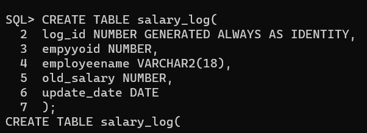
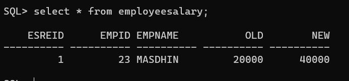

# Ex. No: 5 Creating Triggers using PL/SQL
## DATE:
## AIM: To create a Trigger using PL/SQL.

### Steps:
1. Create employee table with following attributes (empid NUMBER, empname VARCHAR(10), dept VARCHAR(10),salary NUMBER);
2. Create salary_log table with following attributes (log_id NUMBER GENERATED ALWAYS AS IDENTITY, empid NUMBER,empname VARCHAR(10),old_salary NUMBER,new_salary NUMBER,update_date DATE);
3. Create a trigger named as log_salary-update.
4. Inside the trigger block, Insert the values into the salary_log table whenever the salary is updated.
5. End the trigger.
6. Update the salary of an employee in employee table.
7. Whenever a salary is updated for the employee it must be logged into the salary_log table with old salary and new salary.
8. Display the employee table, salary_log table.

### Program:
```
CREATE TABLE employye(
empyyoid NUMBER,
employeename VARCHAR2(10),
dept VARCHAR2(10),
salary NUMBER
);

CREATE TABLE salary_log(
log_id NUMBER GENERATED ALWAYS AS IDENTITY,
empyyoid NUMBER,
employeename VARCHAR2(10),
old_salary NUMBER,
update_date DATE
);
-- Insert the values in the employee table
insert into employye values(1,23,'MASDHIN',20000,40000);

```
### Create employee table


### Create salary_log table


### PLSQL Trigger code
```
-- Create the trigger =
CREATE OR REPLACE TRIGGER log_sal_update
BEFORE UPDATE ON employe
FOR EACH ROW
BEGIN
IF :0LD.salary != :NEW.salary THEN
INSERT INTO sal_log (empyyoid, employeename, old_salary, new_salary, update_date)
VALUES (:OLD.empid, :OLD.employeename, :0LD.salary, :NEW.salary, SYSDATE);
END IF;
END;

/

-- Insert the values in the employee table

insert into employye values(1,23,'MASDHIN',20000,40000);

-- Update the salary of an employee
UPDATE employye

SET salary = 68000

WHERE empid = 1;

-- Display the employye table
SELECT * FROM employye;

-- Display the salary_log table
SELECT * FROM sal_log;
```
### Output:


### Result:
Thus the program for creating triggers has been implemented successfully.
